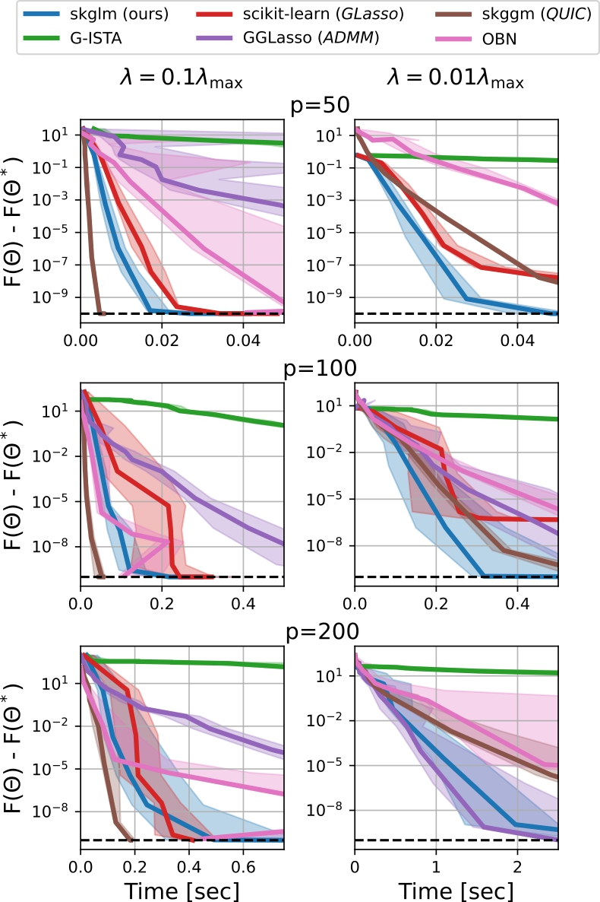

A Graphical Lasso Benchmark
=====================
|Build Status| |Python 3.6+|

**_Dépôt labelisé dans le cadre du [Label Reproductible du GRESTI'25](https://gretsi.fr/colloque2025/recherche-reproductible/)_**

| Label décerné | Auteur | Rapporteur | Éléments reproduits | Liens |
|:-------------:|:------:|:----------:|:-------------------:|:------|
|  | Can POULIQUEN [@Perceptronium](https://github.com/Perceptronium) | Éric DEBREUVE |  Figures 2 et 3 | 📌&nbsp;[Dépôt&nbsp;original](https://github.com/Perceptronium/benchmark_graphical_lasso) ⚙️&nbsp;[Issue](https://github.com/GRETSI-2025/Label-Reproductible/issues/18) 📝&nbsp;[Rapport](https://github.com/akrah/test/tree/main/rapports/Rapport_issue_18) |

Benchopt is a package to simplify and make more transparent and
reproducible comparisons of optimization methods.
This benchmark is dedicated to solvers of the Graphical Lasso estimator (Banerjee et al., 2008):

$$\\min_{\\Theta \\succ 0} - \\log \\det (\\Theta) + \\langle \\Theta, S \\rangle + \\alpha \\Vert \\Theta \\Vert_{1,\\mathrm{off}},$$

where $\\Theta$ is the optimization variable, $S$ is the empirical covariance matrix and $\\alpha$ is the regularization hyperparameter.

Install
--------

This benchmark can be run using the following commands, which first create a dedicated Conda environment:

.. code-block::

   $ conda create -n glasso_bench_env python=3.10
   $ conda activate glasso_bench_env
   $ pip install -U benchopt
   $ git clone https://github.com/Perceptronium/benchmark_graphical_lasso
   $ pip install gglasso
   $ git clone https://github.com/skggm/skggm ./benchmark_graphical_lasso/benchmark_utils/skggm
   $ pip install Cython
   $ pip install -e ./benchmark_graphical_lasso/benchmark_utils/skggm/
   $ benchopt run ./benchmark_graphical_lasso --config ./benchmark_graphical_lasso/simple_conf.yml

Please visit https://benchopt.github.io/ for more details on using the `benchopt` ecosystem.

.. |Build Status| image:: https://github.com/Perceptronium/benchmark_graphical_lasso/actoiworkflows/main.yml/badge.svg
   :target: https://github.com/Perceptronium/benchmark_graphical_lasso/actions
.. |Python 3.6+| image:: https://img.shields.io/badge/python-3.6%2B-blue
   :target: https://www.python.org/downloads/release/python-360/
